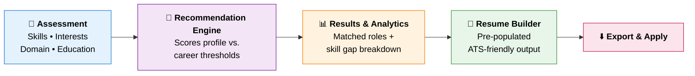

<div align="center">


<a href="https://futurepathx-career-recommender.onrender.com">
  
</a>

<br/>

[](https://futurepathx-career-recommender.onrender.com)
[](https://www.python.org/)
[](https://flask.palletsprojects.com/)
[](LICENSE)
[](#-contributing)


<br/>

### 🌐 [**Live Demo**](https://futurepathx-career-recommender.onrender.com) &nbsp;•&nbsp; [**Features**](#-key-features) &nbsp;•&nbsp; [**How It Works**](#-how-it-works) &nbsp;•&nbsp; [**Quick Start**](#-quick-start) &nbsp;•&nbsp; [**Roadmap**](#-roadmap) &nbsp;•&nbsp; [**Contribute**](#-contributing)

</div>

---

## ✨ What is FuturePathX?

**FuturePathX** is an intelligent, end-to-end career guidance platform that bridges the gap between **skill assessment**, **career discovery**, and **job readiness**.

By evaluating a user's technical skills, personal interests, domain knowledge, and academic background, it delivers **personalized career recommendations**, pinpoints **critical skill gaps**, and instantly generates an **ATS-optimized resume** tailored to the target role.

> 💡 **One platform. Four steps. Zero guesswork.**
> &nbsp;&nbsp;&nbsp;**Assess → Match → Close the gaps → Apply.**

<div align="center">

| 🎯 **Match** | 📈 **Analyze** | 📄 **Build** | ⚡ **Export** |
|:---:|:---:|:---:|:---:|
| Ranked career paths | Exact skill gaps | ATS-friendly resume | Ready to apply |

</div>

---

## 📋 Table of Contents

<details open>
<summary><b>Click to expand / collapse</b></summary>

- [Key Features](#-key-features)
- [How It Works](#-how-it-works)
- [Platform Modules](#-platform-modules)
- [Recommendation Engine](#-recommendation-engine)
- [Supported Career Paths](#-supported-career-paths)
- [Tech Stack](#-tech-stack)
- [Project Structure](#-project-structure)
- [Screenshots](#-screenshots)
- [Quick Start](#-quick-start)
- [Deployment](#-deployment)
- [Roadmap](#-roadmap)
- [Contributing](#-contributing)
- [FAQ](#-faq)
- [License](#-license)
- [Author](#-author)

</details>

---

## 🌟 Key Features

<table>
<tr>
<td width="33%" valign="top">

### 🎯 Smart Career Matching
Data-driven scoring evaluates every answer and ranks the career paths that best fit your strengths and interests.

</td>
<td width="33%" valign="top">

### 📈 Skill Gap Analysis
Pinpoints the exact technical and soft skills missing for your target role, so learning stays focused.

</td>
<td width="33%" valign="top">

### 📄 Integrated Resume Builder
Generates tailored, ATS-friendly resumes straight from your assessment profile. No re-entering data.

</td>
</tr>
<tr>
<td width="33%" valign="top">

### 💰 Salary & Skills Insights
Every recommended role shows its average salary range in INR and the critical skills to learn.

</td>
<td width="33%" valign="top">

### ⚡ Live Preview & PDF Export
Watch your resume update as you type, then download it as a PDF or print it in one click.

</td>
<td width="33%" valign="top">

### 🖤 Premium Black & Gold UI
A polished, responsive dark interface with smooth progress tracking and illustrated question cards.

</td>
</tr>
</table>

---

## 🏗️ How It Works



<div align="center">

| Step | Stage | What Happens |
|:---:|---|---|
| **1** | 📝 **Self-Assessment** | A 10-question interactive test captures your personality, skills, interests, and preferences. |
| **2** | 🧠 **Recommendation Engine** | Inputs are scored against multi-faceted career profiles to compute role alignment. |
| **3** | 📈 **Skill Gap Analysis** | Exact technical and soft skills needed for full proficiency are highlighted. |
| **4** | 📄 **Resume Builder** | Details populate a clean, ATS-compliant layout customized to the recommended role. |

</div>

<details>
<summary><b>📐 Plain-text architecture diagram</b></summary>

```text
 ┌──────────────────────────┐
 │     User Assessment      │  <-- Interactive Skill & Domain Questionnaire
 └─────────────┬────────────┘
               │
               ▼
 ┌──────────────────────────┐
 │  Recommendation Engine   │  <-- Scores Profile vs. Career Thresholds
 └─────────────┬────────────┘
               │
               ▼
 ┌──────────────────────────┐
 │   Results & Analytics    │  <-- Matched Roles & Skill Gap Breakdown
 └─────────────┬────────────┘
               │
               ▼
 ┌──────────────────────────┐
 │ Integrated Resume Builder│  <-- Pre-populated, ATS-Friendly Resume Generation
 └──────────────────────────┘
```

</details>

---

## 🧩 Platform Modules

Once signed in, the top navigation gives access to everything in one place:

| Module | Purpose |
|---|---|
| 🏠 **Dashboard** | Your personal hub and progress overview |
| 🧪 **Career Test** | 10-question assessment to discover best-fit careers |
| 🧭 **Explore Careers** | Browse career paths, salaries, and required skills |
| 📄 **Resume Builder** | Build an ATS-friendly resume with live preview and PDF export |
| 🗺️ **Roadmap** | Step-by-step path toward your chosen career |
| 📈 **Skill Gap** | See exactly which skills you still need |
| 📚 **Resources** | Curated learning material to close your gaps |

---

## 🧠 Recommendation Engine

1. **Input Collection:** Skills, interests, domain familiarity, and academics are captured as a structured profile.
2. **Weighted Scoring:** Each career path defines required skills and interest signals; the profile is scored against each.
3. **Threshold Matching:** Scores are compared with per-career thresholds to determine alignment.
4. **Ranking:** Careers are ranked and the top matches are shown with a clear alignment score.
5. **Gap Computation:** For the chosen role, *skills required* are diffed against *skills possessed* to produce a prioritized learning list.

```text
Match Score (career) = Σ ( weight(skill) × user_proficiency(skill) ) / Σ weight(skill)
Skill Gap  (career)  = Required Skills − User Skills
```

---

## 🧭 Supported Career Paths

| Domain | Example Roles |
|---|---|
| 📊 **Data Science & AI** | Data Scientist • AI / ML Engineer • Data Analyst |
| 🌐 **Web Development** | Frontend • Backend • Full-Stack Developer |
| 🔐 **Cyber Security** | Security Analyst • Penetration Tester |
| ☁️ **Cloud Engineering** | Cloud Engineer • DevOps Engineer |

> ➕ Adding a new career is as simple as extending the career dataset. See [Contributing](#-contributing).

---

## 🛠️ Tech Stack

<div align="center">


<br/><br/>

| Layer | Technology |
|:---|:---|
| **Language** |  |
| **Backend** |  |
| **Frontend** |    |
| **Hosting** |  |
| **Version Control** |   |

</div>

---

## 📁 Project Structure

```text
futurepathx-career-recommender/
│
├── app.py                  # Flask application entry point & routes
├── requirements.txt        # Python dependencies
├── Procfile                # Process definition for deployment
│
├── templates/              # Jinja2 HTML templates
│   ├── index.html          # Landing page
│   ├── assessment.html     # Interactive questionnaire
│   ├── results.html        # Career matches & skill gap analysis
│   └── resume.html         # Resume builder & preview
│
├── static/
│   ├── css/                # Stylesheets
│   ├── js/                 # Client-side scripts
│   └── images/             # Icons & assets
│
└── README.md
```

> ⚠️ Adjust this tree to match the actual repository layout.

---

## 📸 Screenshots

A sleek **black & gold** interface, designed to feel premium from the first click.

### 🔐 1. Create Your Identity
<div align="center">
  
  <br/><sub><i>Minimal, elegant sign-up. Create an account and get straight into your journey.</i></sub>
</div>

<br/>

### 🧪 2. Career Assessment Test
<div align="center">
  
  <br/><sub><i>A 10-question assessment with a live progress bar, illustrated question cards, and a Back button to revisit answers.</i></sub>
</div>

<br/>

### 🎯 3. Career Recommendations
<div align="center">
  
  <br/><sub><i>Ranked matches with a "Best Fit" badge, match compatibility %, average salary in INR, and critical skills for each role.</i></sub>
</div>

<br/>

### 📄 4. Resume Builder
<div align="center">
  
  <br/><sub><i>Sectioned form (Personal, Education, Experience, Skills, Projects, Certs) with a live resume preview, PDF download, and print.</i></sub>
</div>

---

## 🚀 Quick Start

### Prerequisites

- **Python 3.8+**
- **pip**
- **Git**

### Installation

```bash
# 1. Clone the repository
git clone https://github.com/Bharath-B2411/futurepathx-career-recommender.git
cd futurepathx-career-recommender

# 2. Create & activate a virtual environment
python -m venv venv
source venv/bin/activate        # macOS / Linux
venv\Scripts\activate           # Windows

# 3. Install dependencies
pip install -r requirements.txt

# 4. Run the app
python app.py
```

Then open **http://127.0.0.1:5000** in your browser. 🎉

---

## ☁️ Deployment

FuturePathX is live on **[Render](https://render.com)**. To deploy your own instance:

1. Fork this repository.
2. On Render, choose **New → Web Service** and connect your fork.
3. Use these settings:

| Setting | Value |
|---|---|
| **Environment** | Python 3 |
| **Build Command** | `pip install -r requirements.txt` |
| **Start Command** | `gunicorn app:app` |

4. Click **Create Web Service**. Every push to `master` redeploys automatically.

> ⏱️ On free-tier hosting, the first request after inactivity may take a few seconds while the server wakes up.

---

## 🔮 Roadmap

- [x] 🎯 Skill assessment & career matching
- [x] 📈 Skill gap analysis
- [x] 📄 ATS-friendly resume generation
- [x] ☁️ Live deployment on Render
- [x] 👤 User registration & login
- [x] 📥 PDF download & print for resumes
- [x] 💰 Salary ranges and critical skills per career
- [ ] 🤖 AI-powered recommendations trained on real job-market data
- [ ] 🗺️ Personalized learning roadmaps with curated courses per skill gap
- [ ] 📑 Multiple resume templates with one-click switching
- [ ] 📄 DOCX resume export
- [ ] 🔍 ATS score checker against a job description
- [ ] 💼 Live job listings matched to recommended roles
- [ ] 🌍 Multi-language support

---

## 🤝 Contributing

Contributions are what make open source great, and every one is **greatly appreciated**.

```bash
# 1. Fork the repo, then create your feature branch
git checkout -b feature/AmazingFeature

# 2. Commit your changes
git commit -m "Add some AmazingFeature"

# 3. Push to the branch
git push origin feature/AmazingFeature

# 4. Open a Pull Request 🎉
```

💡 **Good first contributions:** new career profiles, improved scoring logic, extra resume templates, UI polish.

<div align="center">

**Thanks to everyone who has contributed!**

<a href="https://github.com/Bharath-B2411/futurepathx-career-recommender/graphs/contributors">
  
</a>

</div>

---

## ❓ FAQ

<details>
<summary><b>Is FuturePathX free to use?</b></summary>
Yes. The live app is free and open source under the MIT license.
</details>

<details>
<summary><b>What does "ATS-friendly" mean?</b></summary>
Applicant Tracking Systems parse resumes automatically. FuturePathX uses clean, single-column layouts with standard headings so recruiter software reads your resume correctly.
</details>

<details>
<summary><b>Can I add my own career paths?</b></summary>
Yes. Extend the career dataset with the required skills and thresholds for a new role and the engine picks it up.
</details>

<details>
<summary><b>The live demo is slow to load. Why?</b></summary>
It runs on free-tier hosting, which sleeps after inactivity. Give it a few seconds to wake up.
</details>

---

## 📄 License

Distributed under the **MIT License**. See [`LICENSE`](LICENSE) for details.

---

## 👤 Author

<div align="center">

**Bharath**

[](https://github.com/Bharath-B2411)
[](https://linkedin.com/in/YOUR-PROFILE)

<br/>

### ⭐ Star History

<a href="https://star-history.com/#Bharath-B2411/futurepathx-career-recommender&Date">
  
</a>

<br/><br/>

### 💚 If FuturePathX helped you, give it a star!

**[🌐 Try the Live Demo](https://futurepathx-career-recommender.onrender.com)**

Built with ❤️ to help students and early-career professionals find their path.

</div>


