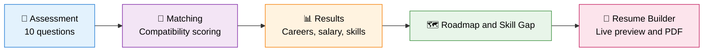

<div align="center">


<a href="https://futurepathx-career-recommender.onrender.com">
  
</a>

<br/>

[](https://futurepathx-career-recommender.onrender.com)
[](https://nodejs.org/)
[](https://developer.mozilla.org/en-US/docs/Web/JavaScript)
[](LICENSE)
[](#-contributing)


<br/>

### 🌐 [**Live Demo**](https://futurepathx-career-recommender.onrender.com) &nbsp;•&nbsp; [**Features**](#-key-features) &nbsp;•&nbsp; [**How It Works**](#-how-it-works) &nbsp;•&nbsp; [**Quick Start**](#-quick-start) &nbsp;•&nbsp; [**Roadmap**](#-roadmap) &nbsp;•&nbsp; [**Contribute**](#-contributing)

</div>

---

## ✨ What is FuturePathX?

**FuturePathX** is an AI-powered career guidance platform that bridges the gap between **skill assessment**, **career discovery**, and **job readiness**.

It evaluates your personality, skills, and interests through a short assessment, delivers **personalized career recommendations**, pinpoints **critical skill gaps**, generates a **learning roadmap**, and lets you build an **ATS-friendly resume** with live preview and PDF export.

> 💡 **One platform. Four steps. Zero guesswork.**
> &nbsp;&nbsp;&nbsp;**Assess → Match → Close the gaps → Apply.**

<div align="center">

| 🎯 **Match** | 📈 **Analyze** | 🗺️ **Plan** | 📄 **Build** |
|:---:|:---:|:---:|:---:|
| Ranked career paths | Exact skill gaps | Step-by-step roadmap | ATS-friendly resume |

</div>

---

## 📋 Table of Contents

<details open>
<summary><b>Click to expand / collapse</b></summary>

- [Key Features](#-key-features)
- [How It Works](#-how-it-works)
- [Platform Modules](#-platform-modules)
- [Tech Stack](#-tech-stack)
- [Project Structure](#-project-structure)
- [Screenshots](#-screenshots)
- [Quick Start](#-quick-start)
- [Deployment](#-deployment)
- [Roadmap](#-roadmap)
- [Contributing](#-contributing)
- [FAQ](#-faq)
- [License](#-license)
- [Author](#-author)

</details>

---

## 🌟 Key Features

<table>
<tr>
<td width="33%" valign="top">

### 🎯 Smart Career Matching
A 10-question assessment ranks career paths by match compatibility, with a "Best Fit" highlight.

</td>
<td width="33%" valign="top">

### 📈 Skill Gap Analysis
Pinpoints the exact skills missing for your target role so learning stays focused.

</td>
<td width="33%" valign="top">

### 🗺️ Roadmap Generation
Turns your chosen career into a clear, step-by-step path you can follow.

</td>
</tr>
<tr>
<td width="33%" valign="top">

### 💰 Salary & Skills Insights
Every recommended role shows its average salary range in INR and its critical skills.

</td>
<td width="33%" valign="top">

### 📄 Resume Builder
Sectioned form with live preview, PDF download, and print, built for ATS-friendly output.

</td>
<td width="33%" valign="top">

### 🖤 Premium Black & Gold UI
A polished, responsive dark interface with progress tracking and illustrated question cards.

</td>
</tr>
</table>

---

## 🏗️ How It Works



<div align="center">

| Step | Stage | What Happens |
|:---:|---|---|
| **1** | 📝 **Self-Assessment** | A 10-question interactive test captures your personality, skills, interests, and preferences. |
| **2** | 🧠 **Matching** | Answers are scored against career profiles to compute a match compatibility percentage. |
| **3** | 📊 **Results** | Matches are ranked, each with salary range and critical skills. |
| **4** | 📈 **Skill Gap and Roadmap** | See what you still need to learn and the path to get there. |
| **5** | 📄 **Resume Builder** | Build and export a professional resume for your target role. |

</div>

---

## 🧩 Platform Modules

Once signed in, the top navigation gives access to everything in one place:

| Module | Purpose |
|---|---|
| 🏠 **Dashboard** | Your personal hub and progress overview |
| 🧪 **Career Test** | 10-question assessment to discover best-fit careers |
| 🧭 **Explore Careers** | Browse career paths, salaries, and required skills |
| 📄 **Resume Builder** | Build an ATS-friendly resume with live preview and PDF export |
| 🗺️ **Roadmap** | Step-by-step path toward your chosen career |
| 📈 **Skill Gap** | See exactly which skills you still need |
| 📚 **Resources** | Curated learning material to close your gaps |

---

## 🛠️ Tech Stack

<div align="center">


<br/><br/>

| Layer | Technology |
|:---|:---|
| **Frontend** |    |
| **Backend** |  |
| **Hosting** |  |
| **Version Control** |   |

</div>

---

## 📁 Project Structure

```text
futurepathx-career-recommender/
│
├── .github/workflows/      # CI workflow (Node.js)
├── assets/                 # Images and static assets
├── css/                    # Stylesheets
├── js/                     # Client-side scripts
├── pages/                  # App pages (test, careers, resume, roadmap...)
│
├── index.html              # Landing page
├── server.js               # Node.js server entry point
├── package.json            # Project metadata & scripts
├── package-lock.json       # Locked dependency versions
├── .gitignore
└── README.md
```

---

## 📸 Screenshots

A sleek **black & gold** interface, designed to feel premium from the first click.

### 🔐 1. Create Your Identity
<div align="center">
  
  <br/><sub><i>Minimal, elegant sign-up. Create an account and get straight into your journey.</i></sub>
</div>

<br/>

### 🧪 2. Career Assessment Test
<div align="center">
  
  <br/><sub><i>A 10-question assessment with a live progress bar, illustrated question cards, and a Back button to revisit answers.</i></sub>
</div>

<br/>

### 🎯 3. Career Recommendations
<div align="center">
  
  <br/><sub><i>Ranked matches with a "Best Fit" badge, match compatibility %, average salary in INR, and critical skills for each role.</i></sub>
</div>

<br/>

### 📄 4. Resume Builder
<div align="center">
  
  <br/><sub><i>Sectioned form (Personal, Education, Experience, Skills, Projects, Certs) with a live resume preview, PDF download, and print.</i></sub>
</div>

---

## 🚀 Quick Start

### Prerequisites

- **Node.js 18+** and **npm**
- **Git**

### Installation

```bash
# 1. Clone the repository
git clone https://github.com/Bharath-B2411/futurepathx-career-recommender.git
cd futurepathx-career-recommender

# 2. Install dependencies
npm install

# 3. Start the server
node server.js
```

Then open the address printed in your terminal (commonly **http://localhost:3000**) in your browser. 🎉

---

## ☁️ Deployment

FuturePathX is live on **[Render](https://render.com)**. To deploy your own instance:

1. Fork this repository.
2. On Render, choose **New → Web Service** and connect your fork.
3. Use these settings:

| Setting | Value |
|---|---|
| **Environment** | Node |
| **Build Command** | `npm install` |
| **Start Command** | `node server.js` |

4. Click **Create Web Service**. Every push to `master` redeploys automatically.

> 💡 Make sure `server.js` listens on `process.env.PORT`, as Render assigns the port automatically.
>
> ⏱️ On free-tier hosting, the first request after inactivity may take a few seconds while the server wakes up.

---

## 🔮 Roadmap

- [x] 🎯 Skill assessment & career matching
- [x] 📈 Skill gap analysis
- [x] 🗺️ Roadmap generation
- [x] 📄 Resume builder with live preview
- [x] 📥 PDF download & print
- [x] 👤 User registration & login
- [x] 💰 Salary ranges and critical skills per career
- [x] ☁️ Live deployment on Render
- [ ] 🤖 Deeper AI-powered recommendations using real job-market data
- [ ] 📑 Multiple resume templates with one-click switching
- [ ] 📄 DOCX resume export
- [ ] 🔍 ATS score checker against a job description
- [ ] 💼 Live job listings matched to recommended roles
- [ ] 🌍 Multi-language support

---

## 🤝 Contributing

Contributions are what make open source great, and every one is **greatly appreciated**.

```bash
# 1. Fork the repo, then create your feature branch
git checkout -b feature/AmazingFeature

# 2. Commit your changes
git commit -m "Add some AmazingFeature"

# 3. Push to the branch
git push origin feature/AmazingFeature

# 4. Open a Pull Request
```

💡 **Good first contributions:** new career profiles, improved matching logic, extra resume templates, UI polish.

---

## ❓ FAQ

<details>
<summary><b>Is FuturePathX free to use?</b></summary>
Yes. The live app is free and open source under the MIT license.
</details>

<details>
<summary><b>What does "ATS-friendly" mean?</b></summary>
Applicant Tracking Systems parse resumes automatically. FuturePathX uses clean, single-column layouts with standard headings so recruiter software reads your resume correctly.
</details>

<details>
<summary><b>The live demo is slow to load. Why?</b></summary>
It runs on free-tier hosting, which sleeps after inactivity. Give it a few seconds to wake up.
</details>

---

## 📄 License

Distributed under the **MIT License**. See [`LICENSE`](LICENSE) for details.

---

## 👤 Author

<div align="center">

**Bharath**

[](https://github.com/Bharath-B2411)

<br/>

### 💚 If FuturePathX helped you, give it a star!

**[🌐 Try the Live Demo](https://futurepathx-career-recommender.onrender.com)**

Built with ❤️ to help students and early-career professionals find their path.

</div>


