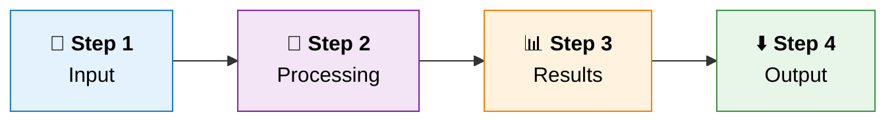

<!--
═══════════════════════════════════════════════════════════════
  PREMIUM README TEMPLATE  (black & gold style)
  Find & replace these placeholders, then delete this comment:

  {{PROJECT_NAME}}      e.g. FuturePathX
  {{TAGLINE}}           e.g. Career Path Recommender & Resume Builder
  {{GITHUB_USER}}       e.g. Bharath-B2411
  {{REPO_NAME}}         e.g. futurepathx-career-recommender
  {{LIVE_URL}}          e.g. https://your-app.onrender.com
  {{DEFAULT_BRANCH}}    master or main
  {{AUTHOR_NAME}}       your name
  {{LINKEDIN_URL}}      your LinkedIn profile URL

  Tips: swap the skillicons list to match your stack
  (https://skillicons.dev), replace the typing lines, and
  keep only the sections that apply to your project.
═══════════════════════════════════════════════════════════════
-->

<div align="center">


<a href="{{LIVE_URL}}">
  
</a>

<br/>

[]({{LIVE_URL}})
[](https://www.python.org/)
[](LICENSE)
[](#-contributing)


<br/>

### 🌐 [**Live Demo**]({{LIVE_URL}}) &nbsp;•&nbsp; [**Features**](#-key-features) &nbsp;•&nbsp; [**How It Works**](#-how-it-works) &nbsp;•&nbsp; [**Quick Start**](#-quick-start) &nbsp;•&nbsp; [**Roadmap**](#-roadmap) &nbsp;•&nbsp; [**Contribute**](#-contributing)

</div>

---

## ✨ What is {{PROJECT_NAME}}?

**{{PROJECT_NAME}}** is {{ONE_SENTENCE_DESCRIPTION_OF_WHAT_IT_DOES_AND_WHO_IT_IS_FOR}}.

{{SECOND_SENTENCE_ABOUT_HOW_IT_WORKS_AND_THE_VALUE_IT_DELIVERS}}.

> 💡 **{{CATCHY_LINE}}**
> &nbsp;&nbsp;&nbsp;**Step one → Step two → Step three → Outcome.**

<div align="center">

| 🎯 **Pillar 1** | 📈 **Pillar 2** | 📄 **Pillar 3** | ⚡ **Pillar 4** |
|:---:|:---:|:---:|:---:|
| Short phrase | Short phrase | Short phrase | Short phrase |

</div>

---

## 📋 Table of Contents

<details open>
<summary><b>Click to expand / collapse</b></summary>

- [Key Features](#-key-features)
- [How It Works](#-how-it-works)
- [Platform Modules](#-platform-modules)
- [Tech Stack](#-tech-stack)
- [Project Structure](#-project-structure)
- [Screenshots](#-screenshots)
- [Quick Start](#-quick-start)
- [Deployment](#-deployment)
- [Roadmap](#-roadmap)
- [Contributing](#-contributing)
- [FAQ](#-faq)
- [License](#-license)
- [Author](#-author)

</details>

---

## 🌟 Key Features

<table>
<tr>
<td width="33%" valign="top">

### 🎯 Feature One
One or two sentences on the benefit.

</td>
<td width="33%" valign="top">

### 📈 Feature Two
One or two sentences on the benefit.

</td>
<td width="33%" valign="top">

### 📄 Feature Three
One or two sentences on the benefit.

</td>
</tr>
<tr>
<td width="33%" valign="top">

### 💰 Feature Four
One or two sentences on the benefit.

</td>
<td width="33%" valign="top">

### ⚡ Feature Five
One or two sentences on the benefit.

</td>
<td width="33%" valign="top">

### 🖤 Feature Six
One or two sentences on the benefit.

</td>
</tr>
</table>

---

## 🏗️ How It Works



<div align="center">

| Step | Stage | What Happens |
|:---:|---|---|
| **1** | 📝 **Stage name** | Describe what happens. |
| **2** | 🧠 **Stage name** | Describe what happens. |
| **3** | 📊 **Stage name** | Describe what happens. |
| **4** | ⬇️ **Stage name** | Describe what happens. |

</div>

---

## 🧩 Platform Modules

| Module | Purpose |
|---|---|
| 🏠 **Module A** | What it does |
| 🧪 **Module B** | What it does |
| 📄 **Module C** | What it does |

---

## 🛠️ Tech Stack

<div align="center">


<br/><br/>

| Layer | Technology |
|:---|:---|
| **Language** |  |
| **Backend** |  |
| **Frontend** |    |
| **Hosting** |  |
| **Version Control** |   |

</div>

---

## 📁 Project Structure

```text
{{REPO_NAME}}/
│
├── app.py                  # Application entry point & routes
├── requirements.txt        # Dependencies
├── Procfile                # Deployment process definition
│
├── templates/              # HTML templates
├── static/
│   ├── css/
│   ├── js/
│   └── images/
│
└── README.md
```

---

## 📸 Screenshots

### 🖼️ 1. Screen Name
<div align="center">
  
  <br/><sub><i>One-line caption describing this screen.</i></sub>
</div>

<br/>

### 🖼️ 2. Screen Name
<div align="center">
  
  <br/><sub><i>One-line caption describing this screen.</i></sub>
</div>

---

## 🚀 Quick Start

### Prerequisites

- **Python 3.8+**
- **pip**
- **Git**

### Installation

```bash
# 1. Clone the repository
git clone https://github.com/{{GITHUB_USER}}/{{REPO_NAME}}.git
cd {{REPO_NAME}}

# 2. Create & activate a virtual environment
python -m venv venv
source venv/bin/activate        # macOS / Linux
venv\Scripts\activate           # Windows

# 3. Install dependencies
pip install -r requirements.txt

# 4. Run the app
python app.py
```

Then open **http://127.0.0.1:5000** in your browser. 🎉

---

## ☁️ Deployment

Live on **[Render](https://render.com)**. To deploy your own instance:

1. Fork this repository.
2. On Render, choose **New → Web Service** and connect your fork.
3. Use these settings:

| Setting | Value |
|---|---|
| **Environment** | Python 3 |
| **Build Command** | `pip install -r requirements.txt` |
| **Start Command** | `gunicorn app:app` |

4. Click **Create Web Service**. Every push to `{{DEFAULT_BRANCH}}` redeploys automatically.

> ⏱️ On free-tier hosting, the first request after inactivity may take a few seconds while the server wakes up.

---

## 🔮 Roadmap

- [x] ✅ Completed feature
- [x] ✅ Completed feature
- [ ] 🤖 Planned feature
- [ ] 📑 Planned feature
- [ ] 🌍 Planned feature

---

## 🤝 Contributing

Contributions are what make open source great, and every one is **greatly appreciated**.

```bash
# 1. Fork the repo, then create your feature branch
git checkout -b feature/AmazingFeature

# 2. Commit your changes
git commit -m "Add some AmazingFeature"

# 3. Push to the branch
git push origin feature/AmazingFeature

# 4. Open a Pull Request 🎉
```

<div align="center">

**Thanks to everyone who has contributed!**

<a href="https://github.com/{{GITHUB_USER}}/{{REPO_NAME}}/graphs/contributors">
  
</a>

</div>

---

## ❓ FAQ

<details>
<summary><b>Question one?</b></summary>
Answer one.
</details>

<details>
<summary><b>Question two?</b></summary>
Answer two.
</details>

---

## 📄 License

Distributed under the **MIT License**. See [`LICENSE`](LICENSE) for details.

---

## 👤 Author

<div align="center">

**{{AUTHOR_NAME}}**

[](https://github.com/{{GITHUB_USER}})
[]({{LINKEDIN_URL}})

<br/>

### ⭐ Star History

<a href="https://star-history.com/#{{GITHUB_USER}}/{{REPO_NAME}}&Date">
  
</a>

<br/><br/>

### 💚 If {{PROJECT_NAME}} helped you, give it a star!

**[🌐 Try the Live Demo]({{LIVE_URL}})**

</div>


